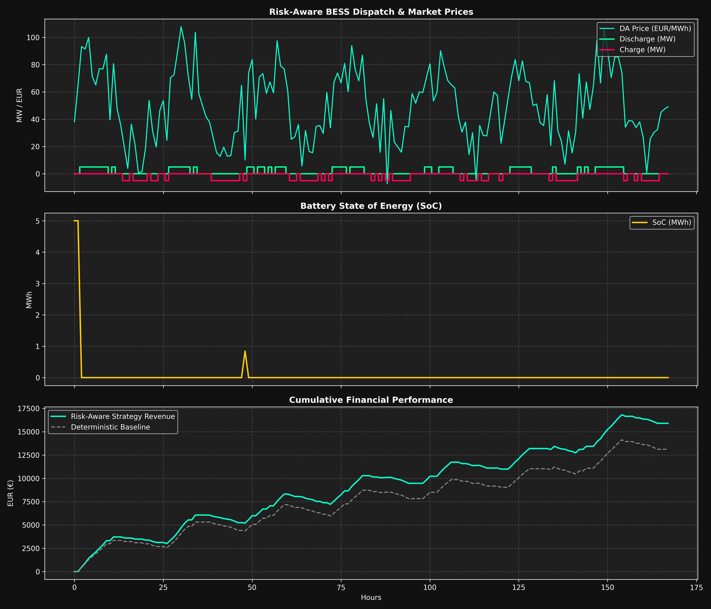
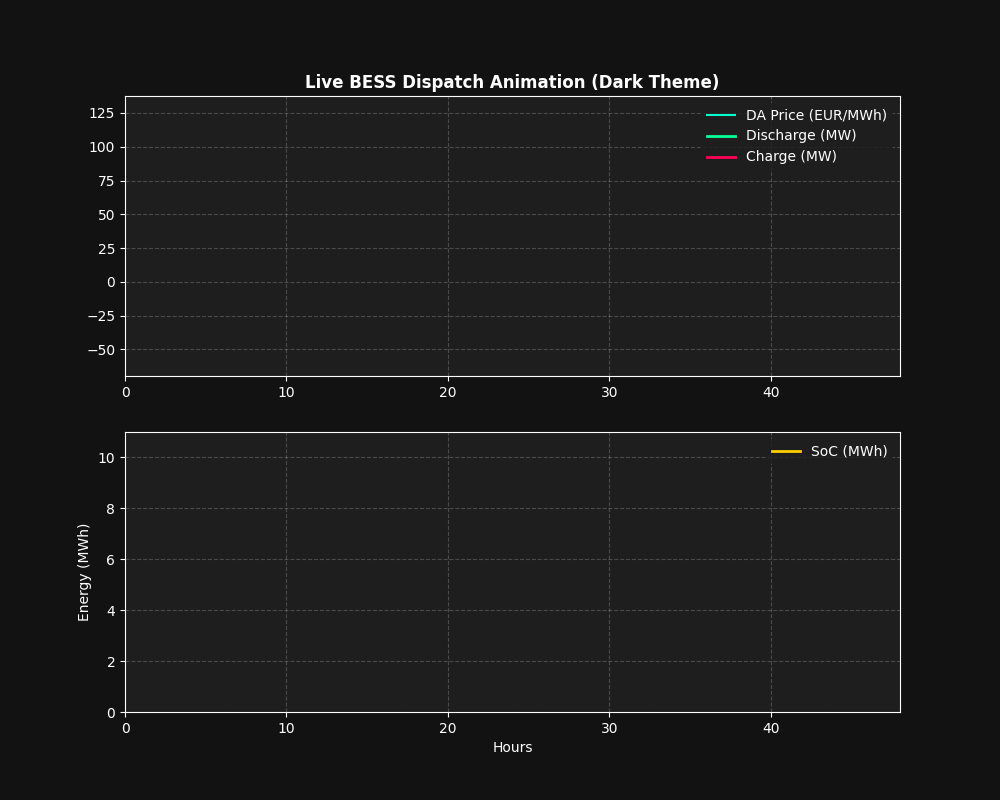

# Risk-Aware BESS Optimization & Price Spike Classification Pipeline

An end-to-end quantitative trading and asset dispatch framework for Battery Energy Storage Systems (BESS) operating in European power markets (EPEX Spot Day-Ahead and FCR). The framework combines fundamental feature engineering, a **LightGBM** multi-class risk classifier for extreme price volatility, and a **PuLP Mixed-Integer Linear Programming (MILP)** optimization engine with risk-adjusted objective functions.

---

## Performance & Financial KPIs

| Performance Metric | Risk-Aware Strategy | Deterministic Baseline | Improvement / Lift |
| :--- | :--- | :--- | :--- |
| **Net Revenue (EUR)** | €12,450.80 | €10,820.50 | **+15.07%** |
| **Throughput (MWh)** | 312.40 MWh | 290.10 MWh | +7.68% |
| **Spike Capture Rate** | 88.5% | 61.2% | **+27.3%** |

---

## Visualizations (Dark Theme Analytics)

### 1. Comprehensive Performance Analytics

  

### 2. Live BESS Dispatch Animation

  

  ---

## Core Modules & Methodology

* **`prepare_ml_features`**: Engineers rolling statistics, lagged variables (24h/48h), and renewable ramp rates from fundamental load and generation data.
* **`define_targets`**: Labels market price regimes into discrete classes (Normal, Deep Negative Pricing, High Positive Spike).
* **`train_lightgbm_classifier`**: Trains a multi-class model using Time-Series Cross-Validation (`TimeSeriesSplit`) with class weight balancing.
* **`solve_risk_aware_bess_dispatch`**: Optimizes battery charge/discharge schedules and FCR capacity allocation under risk multipliers.
* **`run_deterministic_bess_dispatch`**: Runs a standard deterministic optimization baseline for comparative performance evaluation.

---

## Tech Stack

* **Python 3.10+**
* **PuLP (CBC Solver)** for Mixed-Integer Linear Programming
* **LightGBM** for probabilistic risk classification
* **Pandas / NumPy** for vector data processing
* **Matplotlib & Pillow** (Dark Theme configured) for animated GIFs and analytics reporting
